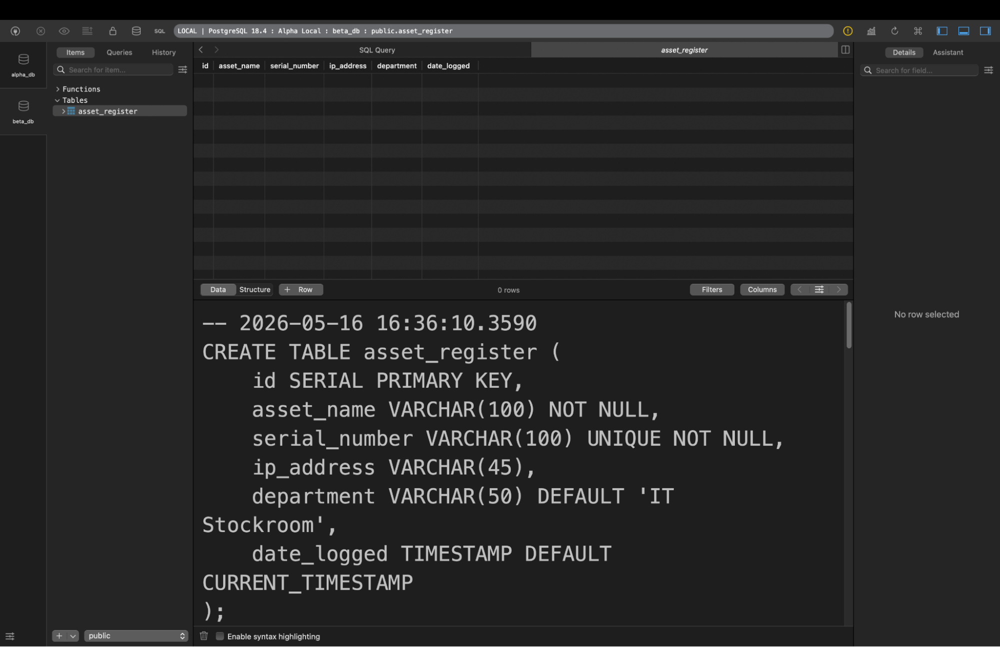
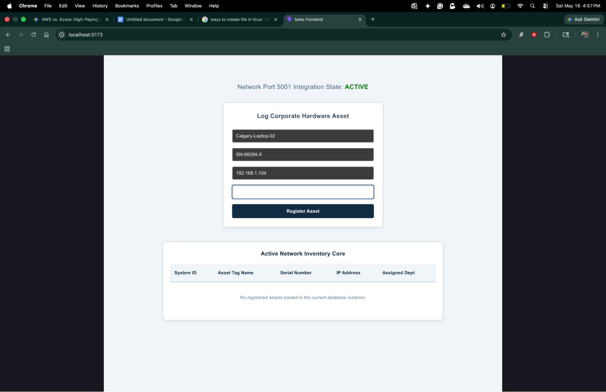
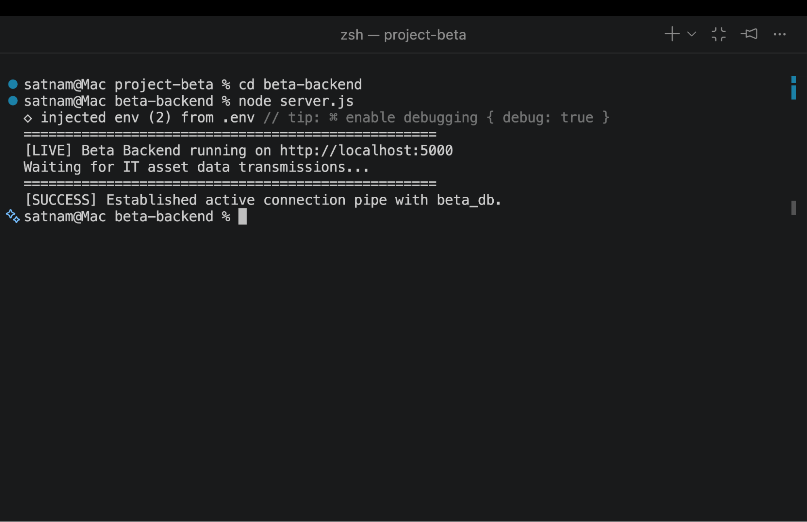
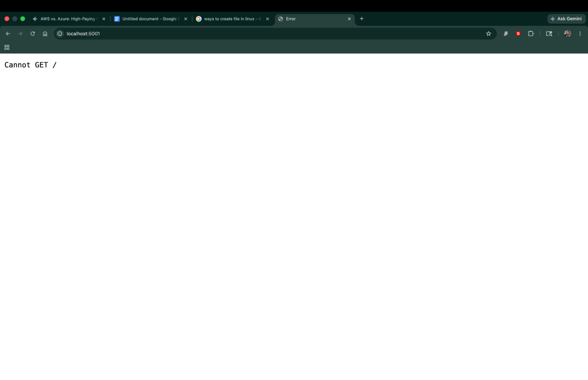
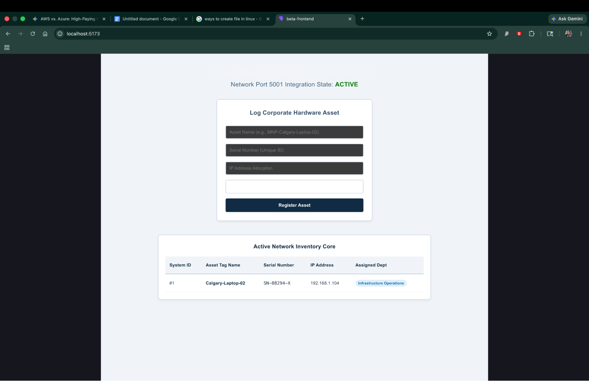
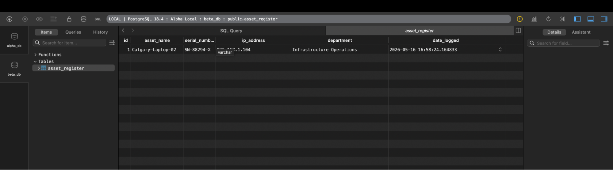
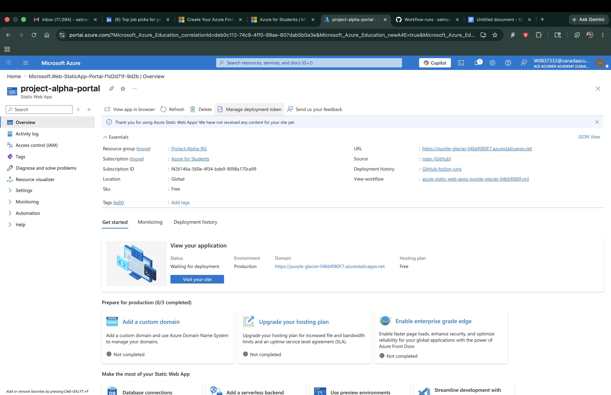
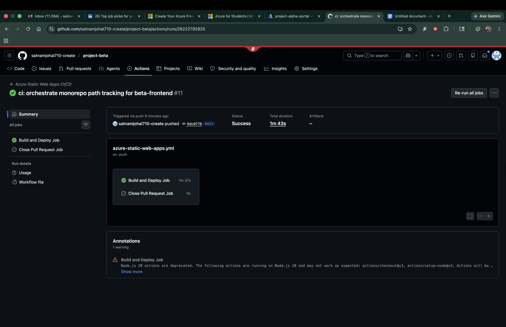

# Enterprise IT Asset Management System (Project Beta)

A high-performance, three-tier full-stack application engineered to securely register, audit, and track corporate hardware infrastructure assets across local network topologies and automated cloud infrastructures.

## 🚀 System Architecture & Core Stack
- **Presentation Layer (Frontend):** React, Vite, Component State management. Deployed via Azure Static Web Apps (SWA).
- **Logic Layer (Backend API):** Node.js, Express, Environment configuration mapping (Port 5001).
- **Data Layer (Relational Database):** PostgreSQL (`beta_db`), Strict structural schema validation via TablePlus.
- **Automation & DevOps:** GitHub Actions CI/CD pipeline featuring automated native builds for monorepo routing.

---

## 📸 Production Infrastructure Proof

### 1. Database Relational Schema Design (TablePlus)
Relational configuration mappings verifying the schema structure, empty data frames, and field indexing definitions inside our local database engine.




---

### 2. Live Node.js API Pipeline Verification
Backend terminal logs confirming that our Express web server is successfully listening on network Port 5001 and has established a secure link to the database.




---

### 3. Asynchronous User Interface Forms & Live Matrix
The responsive corporate hardware logging form alongside our dynamic inventory table, displaying live assets fetched directly from PostgreSQL.




---

## ☁️ Cloud Architecture & Continuous Deployment (CI/CD)

### 4. Automated Cloud Infrastructure Provisioning
The presentation layer has been fully migrated from a local runtime engine to a globally distributed cloud environment on Azure Static Web Apps.



---

### 5. Automated Multi-Step CI/CD Engine
The repository is completely automated using GitHub Actions. Upon a code push to the `main` branch, a runner container spins up an Ubuntu environment, steps directly into the monorepo subfolder, runs a native Vite production build, realigns target folders, and updates the CDN without manual intervention.



---

## 🛠️ Operational Infrastructure Deployment

### Local Environment Compilation
To run this infrastructure ecosystem locally on your workstation:
1. Initialize the PostgreSQL schema in TablePlus using the database query parameters.
2. Step into `/beta-backend`, add your local `.env` variables, and execute `node server.js`.
3. Step into `/beta-frontend`, execute `npm install`, and run `npm run dev`.

### Production Cloud Deployment Engine
The live public cloud architecture uses a custom-wired monorepo pipeline configuration file sitting at `.github/workflows/azure-static-web-apps.yml`. 

```yaml
# Core build block orchestrating the monorepo deployment mapping:
- name: Install Dependencies & Build Frontend
  run: |
    npm install
    npm run build
    mv dist ../vite
  working-directory: "./beta-frontend"